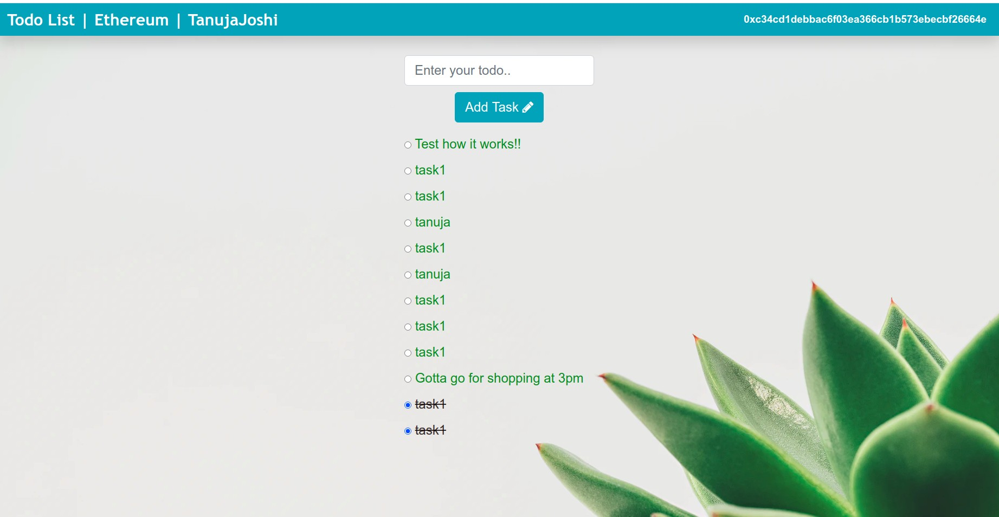

# Ethereum-todo-list
A todo list on Blockchain platform powered by Ethereum smart contracts

It is a basic todo list which lets us understand how blockchain works and how to connect application with a decentralized platform.
  
Unlike a web based todo list , there is not any central authority or a central databse where your data is stored.

The data / your tasks are stored on a decentralized network and it is distributed over the blockchain
